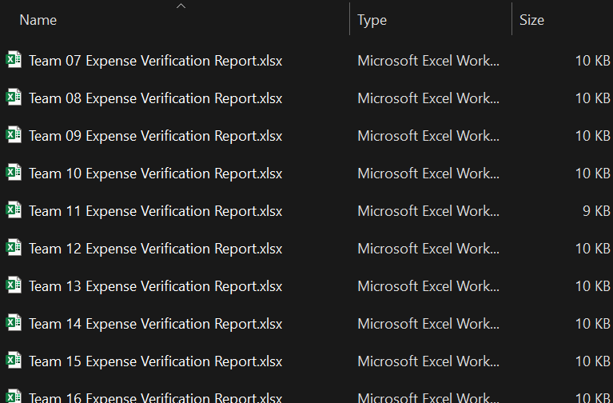

## Example Script

### Background

I wrote this as a showcase of the module, for a use case that is similar to one of my own. (I often need to delegate review tasks to some team members who do not have programming knowledge, but who are familiar with spreadsheets, like most general office workers. I use this module to divvy up a master review spreadsheet into individual report forms for my team to research, verify, fill in, etc., and then return to me.)

### Problem to be solved

Accounting has a spreadsheet of expense reports, showing the 'Price Per Item', the 'Quantity Ordered', and the 'Team Code' (i.e. a unique number for which team made the purchase). They want to check whether each team lead has provided documentation for every purchase, and they want to divvy up that research amongst a handful of accountants.  And to simplify things, accounting doesn't want to bother with any purchase that cost less than $10/item.

Before running the script, a master spreadsheet (`original\purchase_data.xlsx`) was prepared with all the data in it, and review columns were added (the ones with an orange header). And a couple example rows were added for the reviewers' reference.

This script is then run to generate a separate copy of the master spreadsheet for each team (into `reports\Team <##> Expense Verification Report.xlsx`), leaving only the rows relevant to that team, and deleting any purchases that cost at least $10/item. It also adds formulas under 'Total Order Price' to multiply the 'Price Per Item' by the 'Quantity Ordered'.

Now the manager can assign out individual spreadsheets to their team of accountants to fill in and return, after tracking down whatever documentation they need to find.

## Screenshots

Original master spreadsheet:

The report directory after report forms were generated:

Team 7 report form:

Team 8 report form:

